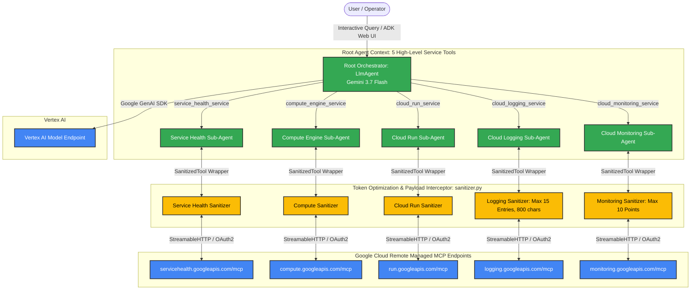

# AI Observability & Predictive Diagnostics Agent on Google Cloud

[](https://www.python.org/downloads/)
[](https://github.com/google/agent-development-kit)
[](https://cloud.google.com/vertex-ai)
[](https://modelcontextprotocol.io/)
[](LICENSE)

An enterprise-grade, multi-agent AI Observability and Predictive Diagnostics system built with **Google's Agent Development Kit (ADK)** and **Gemini 3.7 Flash** on **Vertex AI**. The system orchestrates 5 Google Cloud **Managed Remote Model Context Protocol (MCP)** endpoints over HTTP/SSE with automated payload sanitization, strict least-privilege tool allowlists, and a workload confirmation protocol designed for massive token reduction and precise root-cause analysis (RCA).

---

## 🌟 Key Features

- **Hierarchical 5-Service Architecture**: Instead of overloading the LLM context with hundreds of unconstrained API definitions, the root orchestrator exposes exactly 5 domain-specific service tools via ADK's `AgentTool`.
- **Native Remote Managed MCP Integration**: Connects directly via Streamable HTTP / SSE with OAuth2 authentication to 5 Google Cloud remote MCP servers:
  - **Personalized Service Health** (`servicehealth.googleapis.com/mcp`)
  - **Compute Engine** (`compute.googleapis.com/mcp`)
  - **Cloud Run** (`run.googleapis.com/mcp`)
  - **Cloud Logging** (`logging.googleapis.com/mcp`)
  - **Cloud Monitoring** (`monitoring.googleapis.com/mcp`)
- **Advanced Token Optimization Layer (`sanitizer.py`)**:
  - `SanitizedMcpToolset` & `SanitizedTool` intercept raw MCP responses and prune unnecessary schemas, request payloads, insert IDs, and verbose metadata before they reach the LLM context.
  - **~83.8% token savings** on Cloud Logging payloads by filtering essential error/exception fields and truncating stack traces (`MAX_LOG_MESSAGE_CHARS = 800`).
  - Limits time-series telemetry data points to top recent intervals (`MAX_TIMESERIES_POINTS = 10`).
- **Workload Confirmation Protocol**: For ambiguous diagnostic queries (e.g., *"Check error logs and performance"*), the root agent pauses before invoking heavy telemetry tools to prompt the user for the target scope (**Cloud Run**, **Compute Engine**, or **both**), preventing unnecessary tool calls and token expenditure.
- **Root-Cause Analysis (RCA) & Remediation**: Automatically extracts stack traces, diagnoses underlying faults (e.g., OOM, CPU throttling, missing IAM roles, network timeouts), and synthesizes actionable remediation steps with affected service tables.
- **Least-Privilege & Read-Only Safety**: All mutation, deployment, deletion, and configuration-altering tools are strictly excluded across all 5 MCP endpoints.

---

## 🏗️ System Architecture



---

## 🛡️ Managed MCP Tool Allowlists & Safety Boundaries

To ensure safe production operation, all destructive or mutating operations are filtered out:

| Service | Remote MCP Endpoint | Allowed Read-Only Tools | Excluded Mutation Tools |
| :--- | :--- | :--- | :--- |
| **Personalized Service Health** | `https://servicehealth.googleapis.com/mcp` | `list_project_events`, `get_project_event` | *None (read-only by default)* |
| **Compute Engine** | `https://compute.googleapis.com/mcp` | `list_instances`, `get_instance_basic_info`, `list_disks`, `get_disk_basic_info`, `list_machine_types` | `create_instance`, `delete_instance`, `start_instance`, `stop_instance`, `reset_instance` |
| **Cloud Run** | `https://run.googleapis.com/mcp` | `list_services`, `get_service` | `deploy_service_from_image`, `deploy_service_from_archive`, `deploy_service_from_file_contents` |
| **Cloud Logging** | `https://logging.googleapis.com/mcp` | `list_log_entries`, `list_log_names` | `delete_log`, `create_sink`, `update_sink`, `delete_sink` |
| **Cloud Monitoring** | `https://monitoring.googleapis.com/mcp` | `list_timeseries`, `query_range`, `list_metric_descriptors`, `list_alert_policies`, `get_alert_policy`, `list_alerts`, `get_alert` | `create_alert_policy`, `delete_alert_policy`, `create_notification_channel` |

---

## 📁 Repository Structure

```text
ai-observability-agent/
├── observability_agent/
│   ├── __init__.py             # Package init; exports root_agent for ADK runner / UI
│   ├── agent.py                # 5 Domain Sub-Agents, Root Orchestrator, & Auth
│   ├── config.py               # Constants, lookback limits, metrics, & tool allowlists
│   └── sanitizer.py            # SanitizedMcpToolset, SanitizedTool & JSON pruning filters
├── requirements.txt            # Python dependencies (google-adk, google-genai, mcp, etc.)
├── .env                        # Environment configuration (Project ID, Region, Model)
├── implementation_plan.md      # Detailed architectural & token optimization specification
└── README.md                   # Project documentation
```

---

## 🚀 Getting Started

### 1. Prerequisites

- Python 3.10 or higher
- [Google Cloud SDK (`gcloud`)](https://cloud.google.com/sdk/docs/install) installed and configured
- A Google Cloud Project with the following APIs enabled:
  - Vertex AI API (`aiplatform.googleapis.com`)
  - Compute Engine API (`compute.googleapis.com`)
  - Cloud Run Admin API (`run.googleapis.com`)
  - Cloud Logging API (`logging.googleapis.com`)
  - Cloud Monitoring API (`monitoring.googleapis.com`)
  - Service Health API (`servicehealth.googleapis.com`)

### 2. IAM Roles

Ensure your GCP user or service account has read access to the relevant services:
- **Vertex AI User** (`roles/aiplatform.user`)
- **Compute Viewer** (`roles/compute.viewer`)
- **Cloud Run Viewer** (`roles/run.viewer`)
- **Logs Viewer** (`roles/logging.viewer`)
- **Monitoring Viewer** (`roles/monitoring.viewer`)
- **Service Health Viewer** (`roles/servicehealth.viewer`)

### 3. Installation

1. **Clone the repository:**
   ```bash
   git clone https://github.com/raghav-rg04/ai-observability-agent.git
   cd ai-observability-agent
   ```

2. **Create and activate a virtual environment:**
   ```bash
   python3 -m venv .venv
   source .venv/bin/activate
   ```

3. **Install dependencies:**
   ```bash
   pip install -r requirements.txt
   ```

### 4. Configuration

Create or update the `.env` file in the root directory:

```bash
# Google Cloud & Vertex AI Configuration
GOOGLE_CLOUD_PROJECT=your-gcp-project-id
GOOGLE_CLOUD_LOCATION=global
GOOGLE_GENAI_USE_VERTEXAI=True
GEMINI_MODEL=gemini-3.7-flash
```

### 5. Google Cloud Authentication

Authenticate Application Default Credentials (ADC) to allow the agent to obtain OAuth2 tokens for Vertex AI and the remote MCP servers:

```bash
gcloud auth application-default login
gcloud config set project your-gcp-project-id
```

---

## 💻 Running the Agent

### Option A: ADK Interactive Web UI

Launch the built-in ADK Web Interface:

```bash
adk web ./observability_agent
```

Navigate to `http://localhost:8000` (or the URL displayed in the terminal) to interact with the agent via a browser UI.

### Option B: ADK CLI

Run the agent interactively in your terminal:

```bash
adk run ./observability_agent
```

### Option C: Python Script Execution

You can programmatically invoke the root agent in Python:

```python
import asyncio
from observability_agent.agent import root_agent

async def main():
    print(f"Agent Name: {root_agent.name}")
    print(f"Model: {root_agent.model}")
    print(f"Available Service Tools: {[t.name for t in root_agent.tools]}")

if __name__ == "__main__":
    asyncio.run(main())
```

---

## 💬 Sample Prompts & Verification

| Prompt Type | Sample Prompt | Expected Agent Behavior |
| :--- | :--- | :--- |
| **Cloud Run Discovery** | *"What Cloud Run services are deployed in my project?"* | Invokes only `cloud_run_service` and returns a clean table of services, URLs, and images. |
| **Compute Engine Status** | *"List all VM instances in us-central1 and their statuses."* | Invokes only `compute_engine_service` and reports VM status and machine types. |
| **Ambiguous Diagnostic** | *"Check errors and performance in my project."* | **Workload Confirmation Protocol:** Pauses and asks: *"Would you like me to analyze logs and metrics for **Cloud Run**, **Compute Engine**, or **both**?"* |
| **Predictive Diagnostics & RCA** | *"Analyze Cloud Run error logs and request latencies for the last 24 hours."* | Queries `cloud_monitoring_service` and `cloud_logging_service` with Cloud Run filter, performs root-cause analysis, and provides remediation steps. |
| **Service Disruption Check** | *"Are there any active GCP service disruptions or incidents affecting my project?"* | Invokes `service_health_service` and returns active incidents within the 24-hour window. |

---

## ⚙️ Configuration Reference (`observability_agent/config.py`)

| Parameter | Default Value | Description |
| :--- | :--- | :--- |
| `PROJECT_ID` | `os.environ["GOOGLE_CLOUD_PROJECT"]` | Target Google Cloud Project ID. |
| `GEMINI_MODEL` | `gemini-3.7-flash` | Gemini model endpoint on Vertex AI. |
| `OBSERVABILITY_LOOKBACK_HOURS` | `24` | Maximum lookback window for logs, metrics, and incidents. |
| `MAX_LOG_ENTRIES` | `15` | Maximum log entries retained per MCP call. |
| `MAX_LOG_MESSAGE_CHARS` | `800` | Character truncation cap for log message / stack trace. |
| `MAX_TIMESERIES_POINTS` | `10` | Maximum data points retained per time series. |
| `US_REGIONS` | `["us-central1", "us-east1", ...]` | Monitored US regions for workloads and disruptions. |

---

## 📊 Token Optimization Benchmark

| Payload Type | Raw GCP MCP Response Size | Sanitized Payload Size | Token Reduction |
| :--- | :--- | :--- | :--- |
| **Cloud Logging (15 Entries)** | ~18,500 tokens (incl. httpRequest, insertId, labels) | ~3,000 tokens (error, exception, stack trace) | **~83.8%** |
| **Cloud Monitoring (5 Series)** | ~12,000 tokens (full schemas & metadata) | ~2,200 tokens (metric name, labels, 10 points) | **~81.6%** |
| **Compute Engine (`list_instances`)** | ~8,400 tokens (network interfaces, scheduling) | ~1,100 tokens (name, zone, status, machineType) | **~86.9%** |

---

## 📄 License

This project is licensed under the Apache License 2.0 - see the [LICENSE](LICENSE) file for details.
