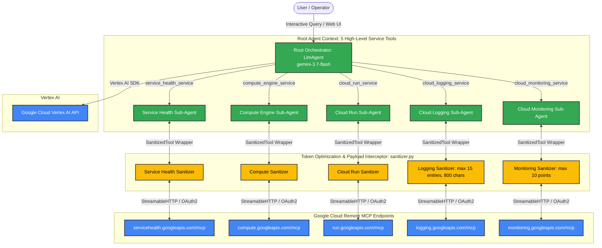

# AI Observability Agent on GCP (ADK & Managed Remote MCP)

This document outlines the architecture, token optimization design, and implementation specifications for the **AI Observability & Predictive Diagnostics Agent**. The scope is limited to GCP Services - Compute Engine and Cloud Run. The system coordinates 5 Google Cloud **Managed Remote MCP (Model Context Protocol)** endpoints—Personalized Service Health, Compute Engine, Cloud Run, Cloud Logging, and Cloud Monitoring—orchestrating diagnostics, root-cause analyses, and predictive health checks through **Gemini 3.7 Flash** on **Vertex AI** using Google's **Agent Development Kit (ADK)**.

---

## 1. Technical Architecture & 5-Service Tool Design

The agent uses a hierarchical **5-Service Tool Architecture** via ADK's `AgentTool`. Instead of loading dozens of raw API tools directly into the root prompt, the root orchestrator exposes exactly 5 high-level service tools. Each service tool encapsulates a specialized domain sub-agent equipped with a `SanitizedMcpToolset` connecting directly to remote Google Cloud MCP endpoints.



---

## 2. Core Operational Rules & Constraints

1. **24-Hour Lookback Constraint:**
   - Personalized Service Health, Cloud Logging, and Cloud Monitoring queries are strictly bounded to the **last 24 hours**.
2. **Workload Scoping:**
   - Observability analysis is scoped strictly to **Cloud Run** (`resource.type = "cloud_run_revision"`) and **Compute Engine** (`resource.type = "gce_instance"`).
3. **Error & Exception Root-Cause Analysis:**
   - Cloud Logging queries focus strictly on `severity >= ERROR` and exceptions.
   - For every error identified, the agent details the error message, exception type, stack trace, executes a root-cause analysis, and provides concrete remediation recommendations.
4. **Workload Confirmation Protocol (Token Savings):**
   - When a user asks a general diagnostic question without specifying the workload, the agent **pauses before invoking Logging or Monitoring tools** and asks:
     > *"Would you like me to analyze logs and metrics for **Cloud Run**, **Compute Engine**, or **both**?"*
   - Queries are then strictly scoped to the user's selected workload, avoiding redundant tool execution.
5. **Least Privilege & Read-Only Safety:**
   - All mutation, deployment, and deletion operations are excluded via strict allowlists on all toolsets.

---

## 3. Token Optimization Architecture

### A. Programmatic Payload Sanitizer (`SanitizedMcpToolset` & `SanitizedTool`)
Raw JSON responses from GCP MCP servers contain substantial metadata, HTTP request dumps, and nested schemas. The agent intercepts and trims these payloads before they reach LLM context:
* **Cloud Logging:** Strips `httpRequest`, `sourceLocation`, `insertId`, and internal labels. Caps at `MAX_LOG_ENTRIES = 15` and truncates stack traces at `MAX_LOG_MESSAGE_CHARS = 800`.
  * **Benchmark:** Achieves **~83.8% reduction in token consumption** on logging payloads.
* **Cloud Monitoring:** Strips full descriptor schemas; retains only `metric.type`, resource labels, and the top `MAX_TIMESERIES_POINTS = 10` data points.
* **Compute Engine:** Strips network interfaces, access configs, service account scopes, and scheduling policies; retains instance name, status, zone, machine type, and disks.
* **Cloud Run:** Strips annotations, managed fields, and verbose deployment specs; retains service name, URL, update time, conditions, and container images.
* **Service Health:** Strips historical log updates; retains title, state, detailedState, impact, and start/update timestamps.

### B. Sub-Agent Concise Output Directives
Each sub-agent is instructed to return **concise structured facts, bullet points, or tables with zero conversational filler**, keeping the root orchestrator's context lean and focused.

---

## 4. Managed MCP Tool Allowlists

| Service & Remote MCP URL | Allowed Read-Only Tools | Excluded Mutation Tools |
| :--- | :--- | :--- |
| **Service Health**<br>`https://servicehealth.googleapis.com/mcp` | `list_project_events`, `get_project_event` | None (all default tools are read-only) |
| **Compute Engine**<br>`https://compute.googleapis.com/mcp` | `list_instances`, `get_instance_basic_info`, `list_disks`, `get_disk_basic_info`, `list_machine_types` | `create_instance`, `delete_instance`, `start_instance`, `stop_instance`, `reset_instance` |
| **Cloud Run**<br>`https://run.googleapis.com/mcp` | `list_services`, `get_service` | `deploy_service_from_image`, `deploy_service_from_archive`, `deploy_service_from_file_contents` |
| **Cloud Logging**<br>`https://logging.googleapis.com/mcp` | `list_log_entries`, `list_log_names`, `list_buckets`, `list_views`, `get_bucket`, `get_view` | `delete_log`, `create_sink`, `update_sink`, `delete_sink` |
| **Cloud Monitoring**<br>`https://monitoring.googleapis.com/mcp` | `list_timeseries`, `query_range`, `list_metric_descriptors`, `list_alert_policies`, `get_alert_policy`, `list_alerts`, `get_alert` | `create_alert_policy`, `delete_alert_policy`, `create_notification_channel` |

---

## 5. Project Structure

```text
ai-observability-agent/
├── observability_agent/
│   ├── __init__.py             # Exposes root_agent for ADK runner / Web UI
│   ├── agent.py                # 5 Sub-Agents with SanitizedMcpToolset & Root Orchestrator
│   ├── config.py               # Timeframe limits, metric constants, filters, and tool allowlists
│   └── sanitizer.py            # SanitizedMcpToolset, SanitizedTool & JSON pruning filters
├── requirements.txt            # Python dependencies (google-adk, google-genai, mcp, python-dotenv)
├── .env                        # Environment variables (PROJECT_ID, GEMINI_MODEL, LOCATION)
└── implementation_plan.md      # Architecture, token optimization, and implementation reference
```

---

## 6. Implementation Reference

### A. [`observability_agent/config.py`](file:///usr/local/google/home/raghavrg/my-google-cloud-env/ai-observability-agent/observability_agent/config.py)
```python
import os
from dotenv import load_dotenv

load_dotenv()

# Environment & Model Configuration
PROJECT_ID = os.environ.get("GOOGLE_CLOUD_PROJECT", "my-first-demo-project-393105")
LOCATION = os.environ.get("GOOGLE_CLOUD_LOCATION", "global")
GEMINI_MODEL = os.environ.get("GEMINI_MODEL", "gemini-3.7-flash")

# Target US Regions for Workloads and Outage Monitoring
US_REGIONS = [
    "us-central1", "us-east1", "us-east4",
    "us-west1", "us-west2", "us-west3", "us-west4",
]

# Lookback Window & Scoped Workloads
OBSERVABILITY_LOOKBACK_HOURS = 24
SCOPED_RESOURCE_TYPES = ["cloud_run_revision", "gce_instance"]

# Token Optimization & Truncation Limits
MAX_LOG_ENTRIES = 15
MAX_LOG_MESSAGE_CHARS = 800
MAX_TIMESERIES_POINTS = 10

# Metric Descriptors
METRIC_CLOUD_RUN_LATENCY = "run.googleapis.com/request_latencies"
METRIC_CLOUD_RUN_REQUEST_COUNT = "run.googleapis.com/request_count"
METRIC_GCE_CPU_UTILIZATION = "compute.googleapis.com/instance/cpu/utilization"

# Standard Scoped Error Filters
LOGGING_FILTER_CLOUD_RUN = 'resource.type = "cloud_run_revision" AND severity >= ERROR'
LOGGING_FILTER_COMPUTE_ENGINE = 'resource.type = "gce_instance" AND severity >= ERROR'
LOGGING_FILTER_BOTH = 'resource.type = ("cloud_run_revision" OR "gce_instance") AND severity >= ERROR'

# Domain Tool Allowlists
SERVICE_HEALTH_TOOLS = {"list_project_events", "get_project_event"}
COMPUTE_TOOLS = {"list_instances", "get_instance_basic_info", "list_disks", "get_disk_basic_info", "list_machine_types"}
CLOUD_RUN_TOOLS = {"list_services", "get_service"}
LOGGING_TOOLS = {"list_log_entries", "list_log_names", "list_buckets", "list_views", "get_bucket", "get_view"}
MONITORING_TOOLS = {"list_timeseries", "query_range", "list_metric_descriptors", "list_alert_policies", "get_alert_policy", "list_alerts", "get_alert"}
```

### B. [`observability_agent/sanitizer.py`](file:///usr/local/google/home/raghavrg/my-google-cloud-env/ai-observability-agent/observability_agent/sanitizer.py)
Provides `SanitizedMcpToolset` and `SanitizedTool`, wrapping `McpToolset` to intercept tool outputs and sanitize JSON payloads according to domain rules.

### C. [`observability_agent/agent.py`](file:///usr/local/google/home/raghavrg/my-google-cloud-env/ai-observability-agent/observability_agent/agent.py)
Instantiates the 5 specialized `LlmAgent`s with `SanitizedMcpToolset` and registers them as `AgentTool`s onto `root_agent`.

---

## 7. Setup & Execution

### 1. Prerequisites & Authentication
```bash
# Authenticate Application Default Credentials
gcloud auth application-default login

# Configure Project
export GOOGLE_CLOUD_PROJECT="my-first-demo-project-393105"
gcloud config set project $GOOGLE_CLOUD_PROJECT
```

### 2. Run Local ADK Web UI / CLI
```bash
# Run web interface
adk web ./observability_agent

# Or test via python
python -c "from observability_agent.agent import root_agent; print(root_agent.name)"
```

### 3. Sample Verification Prompts
1. **Cloud Run Query:** *"What are the cloud run services running in my project?"*
   - $\rightarrow$ Invokes only `cloud_run_service`.
2. **Compute Engine Query:** *"What VM instances are active in us-central1?"*
   - $\rightarrow$ Invokes only `compute_engine_service`.
3. **Ambiguous Diagnostic Query:** *"Check error logs and performance in my project."*
   - $\rightarrow$ Triggers the Workload Confirmation Protocol: asks whether to analyze **Cloud Run**, **Compute Engine**, or **both**.
4. **Full Predictive Diagnostics:** *"Analyze Cloud Run error logs and request latencies for the last 24 hours."*
   - $\rightarrow$ Queries `cloud_monitoring_service` and `cloud_logging_service` for Cloud Run, analyzes root cause, and provides remediation recommendations.
